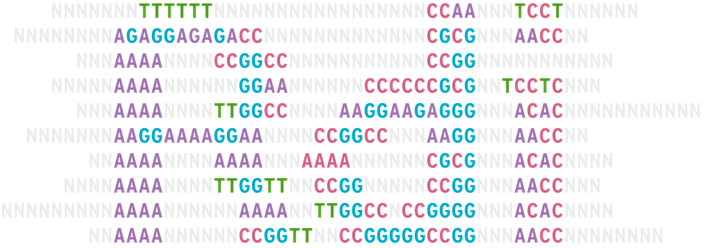

<p align="center">
  
</p>

# 🧬 rdi
RDI (Repeat Detection Index) is a Codon library used to build an index for finding repeated substrings. RDI leverages this index to peform de novo genome assembly.

## 0. Prerequisites
 1. [Codon](https://docs.exaloop.io/codon/) **(with Python >=3.8 interoperability enabled)** and [Seq](https://docs.seq-lang.org/):

```bash
bash -c "$(curl -fsSL https://exaloop.io/install.sh)"
export platform=$(uname -s | awk '{print tolower($0)}')-$(uname -m)
curl -L https://github.com/exaloop/seq/releases/download/v0.11.3/seq-${platform}.tar.gz \
| tar zxvf - -C ~/.codon/lib/codon/plugins
```

Example for Python interoperability:
```bash
export CODON_PYTHON=/usr/lib/python3.8/config-3.8-x86_64-linux-gnu/libpython3.8.so
```

 2. CMake:

```bash
sudo apt install cmake
```

## 1. Setup
 0. Clone the repo: `git clone git@github.com:curtisupshall/rdi`
 1. Fetch submodules: `make submodules`
 2. Install [libdivsufsort](https://github.com/y-256/libdivsufsort): `make libdivsufsort`
 3. Compile RDI: `make rdi`

## 2. Running the Program
RDI runs in two modes. In `index` mode, RDI builds a repeat detection index and writes it to disk next to your input file. In `query` mode, you can make
queries against the index.

### Index Mode

```bash
./rdi index path/to/your/file.fa
```

### Query Mode

```bash
./rdi query -l 10 -r 6
```

|Name|Type|Description
|----|----|-----------
|`-h`, `--help`| - |Help
|`-r`, `--repeats`|`int`|Repeats
|`-l`, `--length`|`int`|Kmer length
|`-i`, `--input`|`string`|Path to batch query file

#### Batch Input File
Write each query as an ordered pair of length, then repeat count. Example:

`$ cat my-file.txt`:

> ```
> 30 20
> 10 50

`./rdi query data/test.fa -i my-file.txt`:

> ```
> 10 GGCCAAGGCG @712432
> 10 TAATCCTAGC @562644
> 10 TACAGGTGCC @1220261
> 10 TAGCTGGGTG @1831828
> 10 TGCGGTGGCT @1821871
> 10 TTTGCCATGT @266207
> 10 TTTTGCCATG @790679
> > Ran 2 queries in 0.240325927734375 ms


## 3. Future Work
 - Indexing strategy; particularly around [perfect minimal hashing](https://en.wikipedia.org/wiki/Perfect_hash_function)
 - Parallelization

## 4. References
Many thanks to M. Oguzhan Kulekci for providing the indexing algorithm used in this project, as well as pseudocode, examples, and general guidance.
